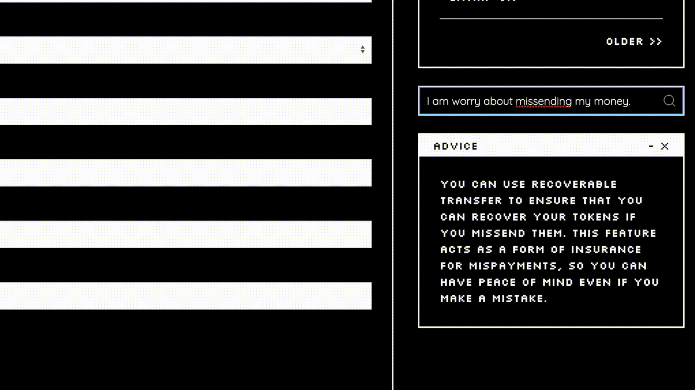

# Integrated Chatbot

KeeperC's chatbot is integrated into both the web app and the extension to provide users with convenient natural language support.
If you need help with anything related to KeeperC, simply type your query into the chatbot, and it will suggest features and functions on KeeperC that you can use.

<!-- TODO: image -->

For example, if you're worried about losing your money by accidentally sending it to the wrong address, you can ask the chatbot for help.
The chatbot will recommend the "Recoverable Transfer" function of KeeperC, which allows you to recover your tokens if you accidentally send them to the wrong address.
The chatbot will also provide a brief explanation of how the function works and why it's a good option for you.

