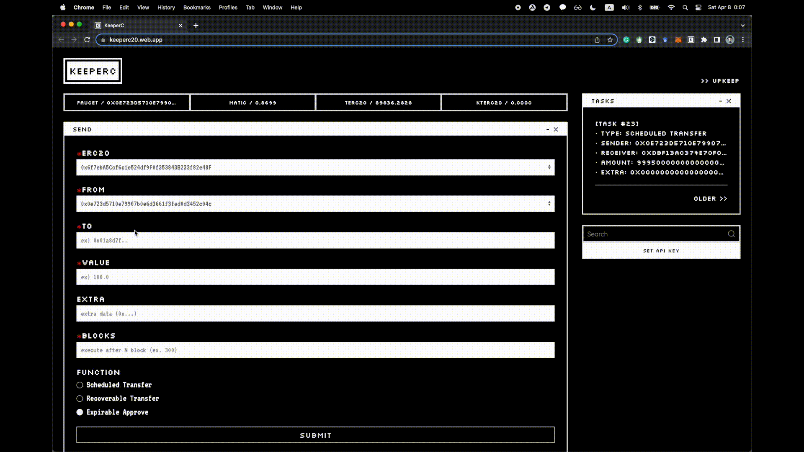

# Scheduled Transfer

<!-- TODO: image -->

The scheduled transfer is a function that automatically transfers ERC20 tokens after a few blocks. A series of bytes can be transferred together, so the contract call is also possible. It is monitored and managed through the Upkeep of Chainlink Automation.

A predefined fee is collected as an ERC20 token when requesting a scheduled transfer.

