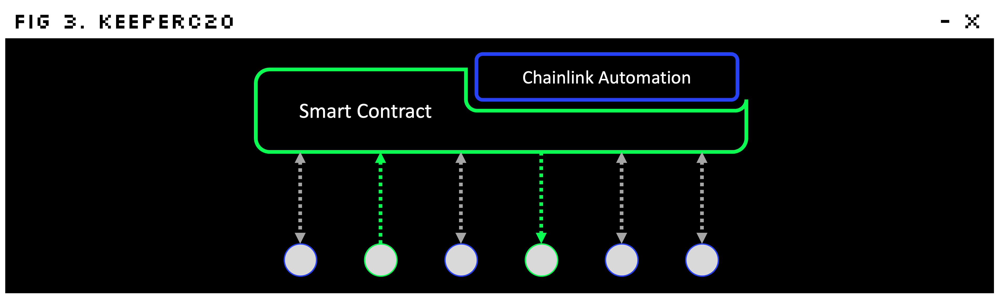

# KeeperC

To provide security and convenience without compromising decentralization, we propose KeeperC, a contract wallet based on smart contracts, Chainlink Automation, and OpenAI API.

Currently, KeeperC offers the following powerful functions:
- `Scheduled Transfer`: You can schedule future transfers of your tokens, making it easier to manage your transactions.
- `Recoverable Transfer`: If you accidentally send your tokens to the wrong address, KeeperC can help you recover them.
- `Expirable Approve`: You can set a time limit for token approvals, increasing the safety of using dApps.

KeeperC includes a **Fraud Detection System** that monitors your transactions and alerts you if any suspicious activity is detected, protecting you against potential hacks and scams.

KeeperC comes with a **chatbot** that uses AI to provide you with natural language support and make it easier to manage your tokens. You can also use KeeperC's chatbot via the popular messaging app, **Telegram**.

We will continuously add more convenient and secure functions to 🄺 KeeperC to ensure that your tokens remain safe and secure.
