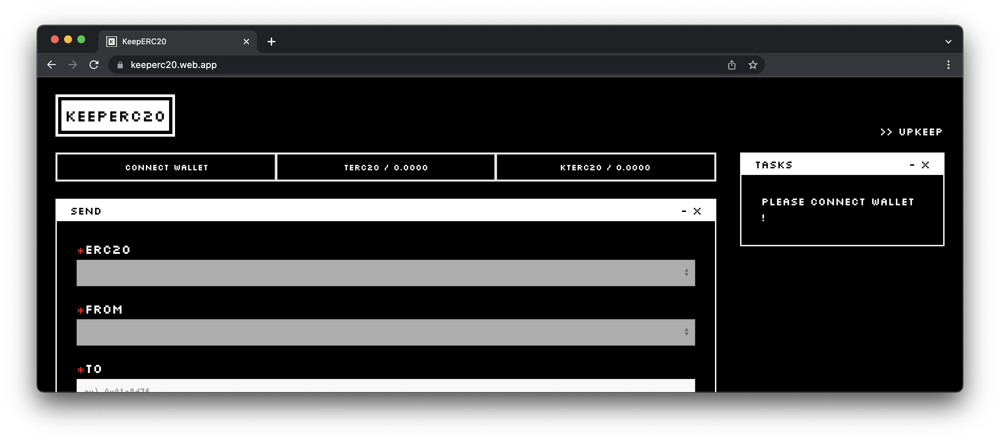
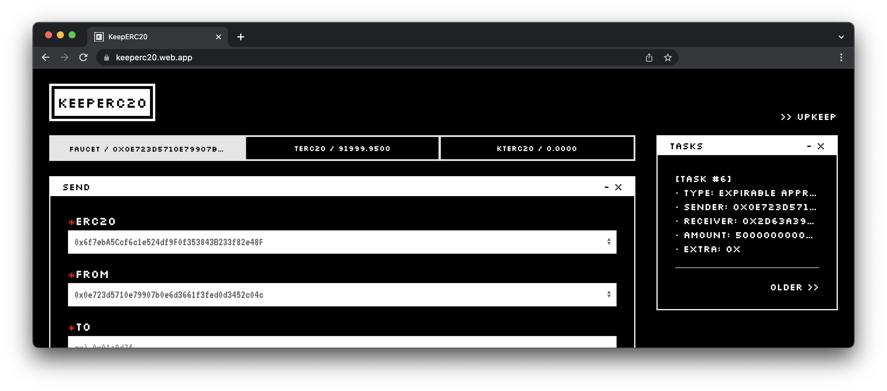

# Web App

:::caution

KeeperC is a contract wallet that allows users to participate in the system with any ERC20 token. However, for test purposes, KeeperC currently only supports the `TERC20` token.

:::

*Mumbai testnet is used for a concrete example.*

- 🔗 [WebApp](http://keeperc20.web.app)
- ✉️ Feedback: [lukepark327@gmail.com](mailto:lukepark327@gmail.com)

---

## Faucet

The faucet for Test ERC20 (TERC20) tokens is available! First, click the "Connect Wallet" button. Then, click the "Faucet" button appearing at the same location.

## Features

You can check your transaction history in the TASKS window.

<!-- TODO: chatbot -->
