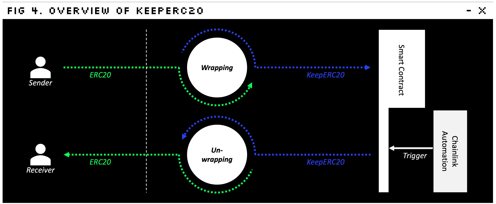

# Overview

- When a user sends ERC20 tokens to KeeperC, they are wrapped into KeeperC tokens, allowing the user to take advantage of various features such as scheduled transfers, lost money recovery, expirable approval, and fraud detection through smart contracts and Chainlink Automation.
- When the recipient receives the tokens, they are automatically unwrapped back into the original ERC20 tokens, making it easy to use the tokens with other dApps.

However, in some cases, simple token wrapping may not be enough to perform certain tasks, such as ownership-related function calls.

To address these cases, KeeperC creates a safe contract wallet internally and provides these functions seamlessly to ensure the security and convenience of users' tokens.

With KeeperC, you can enjoy a secure and convenient way to manage your tokens while participating in the decentralized blockchain ecosystem.
