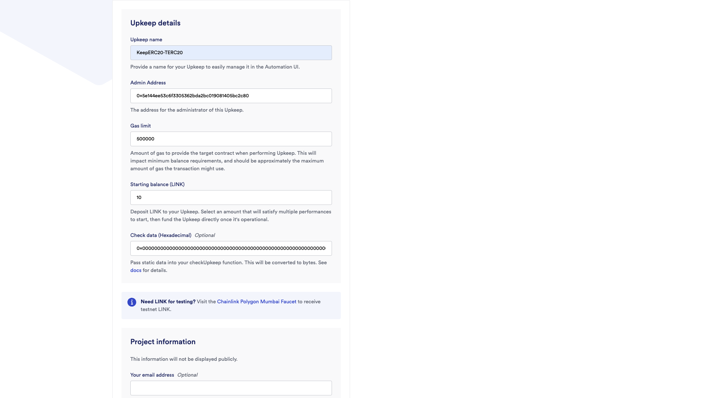
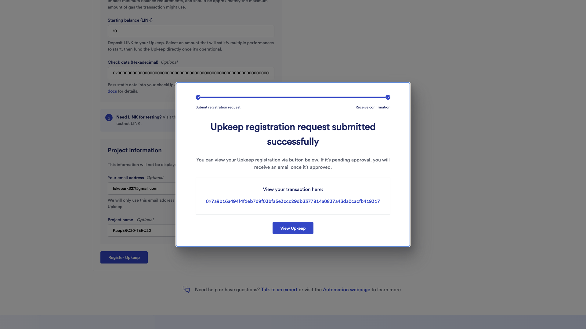
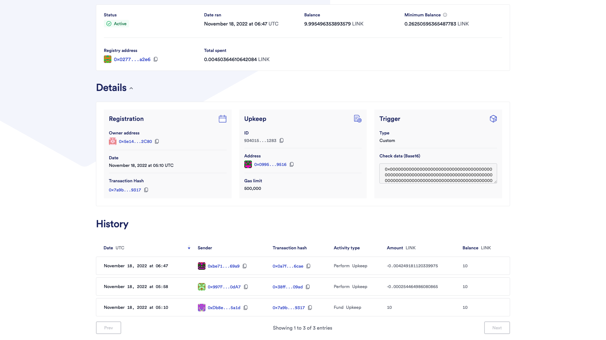

# Register Upkeeps

*Mumbai testnet is used for a concrete example.*

---

# Mumbai Testnet MATIC and LINK

You need sufficient MATICs and LINKs for registering Upkeep.

### Mumbai Faucet

- [Polygon](https://faucet.polygon.technology/)
- [Alchemy](https://mumbaifaucet.com/)

### LINK Faucet

- [Chainlink](https://faucets.chain.link/mumbai)

---

# Register Upkeep

Goto [Chainlink Automation](https://automation.chain.link/mumbai) page.

Register new upkeep through:
- Select `Custom logic`
- Input address of KeepERC20 contact to perform Upkeep on

Set `check data` for pagination (lowerBound, upperBound)
For example, `0x0000000000000000000000000000000000000000000000000000000000000000000000000000000000000000000000000000000000000000000000000000000a` for 0-to-10.

:::tip
You can submit multiple Upkeeps for one KeepERC20 contact with different pagination.
:::

:::caution
Registering the same contract's Upkeeps with the same `check data` is possible but useless and inefficient.
:::

Finally, register Upkeep.

You can manage your Upkeeps through [Chainlink Automation](https://automation.chain.link/mumbai) page.

This is the sample [Upkeep service](https://automation.chain.link/mumbai/9340155388659824822142057473546063992865515110295145464035554787059319211283) named **KeepERC20-TERC20**.

You can see the Upkeep's transaction history:

